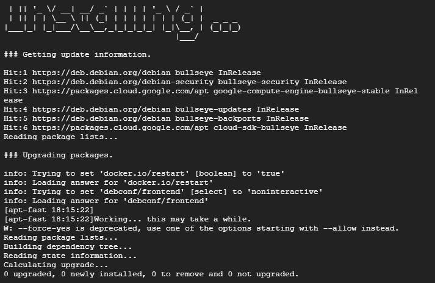

# Exploring TPOT Honeypot: Documentation and Analysis

# Table of Contents
-    [Creating the Virtual Machine Instance](#[lan-overview](#creating-the-virtual-machine-instance))
-    [VPC Firewall Rules/Policies](#vpc-firewall-rulespolicies)
-    [Setting up the VPS Server](#setting-up-the-vps-server)
-    [Analysis](#analysis)
     -    [Overview](#overview)
     -    [Cowrie](#cowrie)
     -    [Who Are the Threat Actors](#who-are-the-threat-actors)
     -    [Attacks](#attacks)
     -    [Commands](#commands)
     -    [Conclusion](#conclusion)

# Creating the Virtual machine Instance

Signing up with Google Cloud gave me a $300 90 day free trial

1. **We start by creating a Virtual machine Instance** 
    1. Instance name: tpot
    
    **Machine Tags and Labels:**
    
    1. Region: us-west4 (Las Vegas)
    2. Zone: us-west4-b

**Machine Configuration:**

Series: E2

Machine type: e2-standard-2 (2 vCPU, 1 core, 8GB memory)

1. Once the machine meets the requirements in the github repo [https://github.com/telekom-security/tpotce](https://github.com/telekom-security/tpotce) we move to the **Boot Disk** option and change the default Debian 12 (bookworm) to Debian 11 (Bullseye) as that is what the Honeypot is based on.
    1. We also set the disk space to 130gb as the recommended amount of free disk space is 128gb
    
    
    
2. Once the Boot disk has been adjusted properly, we can now create our virtual machine instance.

# VPC Firewall Rules/Policies

1. Once the VM has been successfully created, search for **VPC** **Network,** click the option that says “VPC network (Virtual Private Cloud)”
2.  Navigate to the Firewall Section using the menu on the left side of the screen.

1. At the top of the screen should be “Create Firewall Rule” click this

1. Name the firewall rule whatever you want, in this case I chose “**tpot-firewall-rule”**
    1. Ensure Logs are turned off to save on disk space
    2. Leave **Network, Pritority, Direction of traffic,** and **Action on match** as **default.**
    3. Change **Targets** to “**All instances in the network”** 
        1. Source filter: IPv4 ranges
        2. Source IPv4 rances: **0.0.0.0/0**
    4. Set **Protocols and ports** to **Allow all**
    5. Click Create
    
    
    
    
    
    # Setting up the VPS Server
    
    1. SSH into the server you just created
    2. run the command `sudo su` 
        1. then run `apt-get update && apt-get upgrade -y`
        
        
        
        1. Next we need to install Git by running the command `apt install git -y`
        
        
        
        1. We now copy the tpot repo from github using the command `git clone https://github.com/telekom-security/tpotce.git`
        
        
        
        1. `cd tpotce`
            1. `./install.sh —type=user`
        
        
        
    
    6. Upon this screen type `y`  
    
    
    
    1. For our use case we will select the standard option 

1. In the next two screens you will create your `username` and `password`

1. Once you have created your username and password, the installation process will start

1. Once the installation is complete the server will restart itself and you can now access the tpot landing page via `https://YourVPSIP:64297` then logging in with the credentials you just made.

# Analysis

## Overview

After two weeks of being up and running, the server I deployed has seen a massive amount of attacks. During this analysis I will focus on one honeypot in particular Cowrie. Cowrie is a honeypot designed for SSH and Telnet, operating at a medium to high interaction level. It logs brute force attacks and the interactions with the shell performed by the threat actor. The server was Deployed on Apr 3, 2024, 9:45:26 PM and ended on Apr 17, 2024, 1:27:45PM.

To conduct this analysis I will mainly be using the ELK stack (elastic stack) built into the tpot platform comprised of three popular projects Elasricsearch, Logstash, and Kibana. Using the ELK stack allows me to securely and reliably take data from any of my sources, in multiple data formats,  then search, analyze and visualize the data in real time. 

## Cowrie

Rather than narrowing down to a particular time period, I want to take a look at cowrie in its entire deployment from Apr 3rd, to Apr 17th. Within two weeks, Cowrie has received a staggering 77,978 attacks coming from 488 unique source IPs and 27 unique HASSHs, the majority of which were attempting to exploit an ssh vulnerability. To my surprise the majority of attacks were coming from the United states, Singapore, and India. Because of the unbelievable number of attacks that were conducted I decided to start my analysis here. 

### **Who Are the Threat Actors**

For this analysis I will be focusing on the top 3 threat actors in this list **161.35.193.238**, **116.204.171.29**, and **161.35.71.130** for reasons that are quite simple, the top three attackers have conducted a significant amount of attacks. Clicking on the IP address **161.35.193.238** redirects us to Talosintelligence revealing that this IP address in particular is from Frankfurt Am Main, Germany with the network owner being DigitalOcean with the IP reputation of poor as it has been identified to be responsible for a critical amount of spam even making it onto the Talos Security Intelligence Block List with the classification of “Attackers”

Using Talosintelligence to take a look at the second IP address in the list **116.204.171.29,** reveals that this IP address is from Seoul, South Korea with the network owner being moack.co.ltd, with a surprising IP reputation of netural. However, their neutral IP reputation status was not enough for this attacker to evade the Talos Security Intelligence Block List recieving  the classification of “Attackers”.

Lastly, the third IP address **161.35.71.130** falls under all of the same categories including location and network owner as the first IP address except somehow this IP has the reputation of neutral.

### Attacks

Taking a look at the username and password tagclouds gives us an insight on what kinds of usernames and passwords attackers are using to brute force their way into systems. For those who are unfamiliar, a brute force attack is when a threat actor attempts to gain access to a system through a series of username and password combinations. As we can see many of the passwords aren’t very complex and look like something you’d find searching for default credentials or the simple rockyou.txt list. Which is why changing default credentials as well as creating and using strong and complex passwords is an extremely important aspect of security.

### Commands

1. `uname -a`
- The command "uname -a" displays system information on Unix-like operating systems, including details such as the kernel version, machine architecture, and other system-specific information.

1. `cat /proc/cpuinfo | grep model | grep name | wc -l`
- **`cat /proc/cpuinfo`**: This command displays the contents of the file "/proc/cpuinfo", which contains information about the CPU(s) installed on the system.
- **`|`**: A pipe symbol, which passes the output of the previous command
- This information gets piped into `grep model`  This command filters the output from **`cat /proc/cpuinfo`** to display only the lines containing the word "model"
- This gets piped into `grep name`  This command further filters the output from the previous **`grep`** command to display only the lines containing the word "name"
- **`wc -l`**: This command counts the number of lines in the input it receives. In this case, it counts the number of lines outputted by the previous **`grep`** commands, which represent the number of CPU models listed in the system.

So, altogether, the command **`cat /proc/cpuinfo | grep model | grep name | wc -l`** is essentially counting the number of distinct CPU models present in the system.

1. `cat /proc/cpuinfo | grep name | head -n 1 | awk '{print $4,$5,$6,$7,$8,$9;}'`
- **`cat /proc/cpuinfo`**: This command displays the contents of the file "/proc/cpuinfo", which contains information about the CPU(s) installed on the system.
- **`|`**: A pipe symbol, which passes the output of the previous command
- **`grep name`**: This command filters the output from **`cat /proc/cpuinfo`** to display only the lines containing the word "name".
**`head -n 1`**: This command selects only the first line of the input it receives. In this case, it takes the first line outputted by the previous **`grep`** command, which represents the CPU name.
- **`awk '{print $4,$5,$6,$7,$8,$9;}'`**: This **`awk`** command selects specific fields (columns) from the input it receives and prints them. In this case, it prints the 4th, 5th, 6th, 7th, 8th, and 9th fields from the input, which represent various details about the CPU.

So, altogether, the command **`cat /proc/cpuinfo | grep name | head -n 1 | awk '{print $4,$5,$6,$7,$8,$9;}'`** is extracting specific details about the CPU name from the system information provided in the "/proc/cpuinfo" file.

4. `cat /proc/cpuinfo | grep name | wc -l`

- **`cat /proc/cpuinfo`**: This command displays the contents of the file "/proc/cpuinfo", which contains detailed information about the CPU(s) installed on the system.
- **`|`**: A pipe symbol, which passes the output of the previous command
- **`grep name`**: This command filters the output from **`cat /proc/cpuinfo`** to display only the lines containing the word "name".
- **`wc -l`**: This command counts the number of lines in the input it receives. In this case, it counts the number of lines outputted by the previous **`grep`** command, which represent the number of occurrences of the word "name" in the CPU information.

So, altogether, the command **`cat /proc/cpuinfo | grep name | wc -l`** is counting the number of occurrences of the word "name" in the CPU information displayed by the "/proc/cpuinfo" file. This typically indicates the number of CPU cores or processor threads.

1. `cd ~; chattr -ia .ssh; lockr -ia .ssh`
- **`cd ~`**: This command changes the current directory to the user's home directory (**`~`**), which is typically where personal configuration files and directories are stored.
- **`;`**: This semicolon acts as a command separator, allowing multiple commands to be executed sequentially on the same line.
- **`chattr -ia .ssh`**: This command uses the **`chattr`** utility to modify file attributes. Specifically, it removes the "immutable" (**`i`**) and "append-only" (**`a`**) attributes from the **`.ssh`** directory. This allows files within the **`.ssh`** directory to be modified or deleted.
- **`;`**: Another command separator.
- **`lockr -ia .ssh`**: This command appears to be a custom command (**`lockr`**) that also modifies file attributes. It's likely intended to perform a similar action to **`chattr`**, removing the "immutable" (**`i`**) and "append-only" (**`a`**) attributes from the **`.ssh`** directory.

So, altogether, the command **`cd ~; chattr -ia .ssh; lockr -ia .ssh`** changes to the user's home directory and then removes the "immutable" and "append-only" attributes from the **`.ssh`** directory, potentially allowing modifications to files within that directory.

1. `crontab -l`
- **`crontab`**: This command is used to manage the cron jobs for a user. Cron is a time-based job scheduler in Unix-like operating systems.
- **`l`**: This option is used with the **`crontab`** command to list the user's cron jobs. It displays the user's crontab file on the standard output.

So, altogether, the command **`crontab -l`** is used to list the cron jobs scheduled for the current user. It shows the contents of the user's crontab file.

1. `free -m | grep Mem | awk '{print $2 ,$3, $4, $5, $6, $7}'`
- **`free -m`**: This command displays the amount of free and used memory in the system, with the option **`m`** specifying that the memory should be shown in megabytes.
- **`|`**: This is the pipe symbol, which takes the output from the command on the left (**`free -m`**) and passes it as input to the command on the right (**`grep Mem`**).
- **`grep Mem`**: This command filters the output from **`free -m`** to display only the line containing the word "Mem". This line provides information specifically about the system's memory.
- **`|`**: Another pipe symbol, passing the output of the previous command (**`grep Mem`**) as input to the next command (**`awk '{print $2 ,$3, $4, $5, $6, $7}'`**).
- **`awk '{print $2 ,$3, $4, $5, $6, $7}'`**: This **`awk`** command selects specific fields (columns) from the input it receives and prints them. In this case, it prints the 2nd, 3rd, 4th, 5th, 6th, and 7th fields from the input, which represent different aspects of the memory usage (total memory, used memory, free memory, shared memory, buffers, and cached memory).

So, altogether, the command **`free -m | grep Mem | awk '{print $2 ,$3, $4, $5, $6, $7}'`** retrieves and formats specific details about the system's memory usage, such as total memory, used memory, free memory, and other related metrics.

1. `lockr -ia .ssh`
- **`lockr`**: This appears to be a command or utility. Without additional context or documentation, it's difficult to determine its exact function. It likely relates to managing file or directory permissions, but its specific behavior depends on the implementation and any custom configurations.
- **`ia`**: These are options or flags passed to the **`lockr`** command. Again, without further context, it's challenging to provide precise details about what these options do. Typically, options like **`i`** might indicate setting or removing file attributes, while **`a`** could represent an action related to file attributes or access control.
- **`.ssh`**: This is an argument passed to the **`lockr`** command. It likely specifies the directory or file to which the command's action applies. In this case, **`.ssh`** is a common directory used for SSH-related configuration and keys.

So, altogether, the command **`lockr -ia .ssh`** appears to involve some operation related to managing permissions or attributes of the **`.ssh`** directory or its contents, but without more information about the **`lockr`** command, its specific behavior can't be determined definitively.

1. `ls -lh $(which ls)`
- **`ls`**: This is the command to list directory contents in Unix-like operating systems.
- **`lh`**: These are options or flags passed to the **`ls`** command:
    - **`l`**: This option enables the long listing format, which provides detailed information about each file or directory, including permissions, ownership, size, and modification date.
    - **`h`**: This option makes the file sizes "human-readable", meaning they are displayed in a format like "1K", "2M", etc., instead of raw byte counts.
- **`$(which ls)`**: This part of the command is a command substitution. The **`which`** command is used to locate the executable file associated with a given command (**`ls`** in this case). The **`$(...)`** syntax executes the **`which`** command and substitutes its output into the original command. So, **`$(which ls)`** provides the full path to the **`ls`** command.

Altogether, the command **`ls -lh $(which ls)`** lists detailed information about the **`ls`** command itself, including its permissions, size, and other attributes.

1. `top`

The command "top" is a built-in Unix/Linux command used to display dynamic real-time information about system processes and resource usage. When executed, "top" opens an interactive display showing a list of currently running processes, along with details such as CPU and memory usage, process IDs (PIDs), and more. This information is continually updated, allowing users to monitor system performance and identify resource-intensive processes. Pressing "q" exits the "top" display and returns the user to the command prompt

# Conclusion

Although I only had tpot running for two weeks the number of attacks really opened my eyes to the potential threats that companies face on a daily basis. My recommendations for companies would be to create security policies that place users into specific security groups in order to restrict/control access. Another action that I would recommend for a company or large corporation to take would be to close ports that aren’t in use by the organization itself as open ports greatly increases the attack surface. Lastly what I would suggest that companies enforce strong password security policies that require upper and lowercase letters, symbols and numbers, preferably with a high minimum character length.

This was an interesting project for me as it helped me understand and realize the importance of blue teamers and what they do. As someone who would align himself with red teamers, this was an eye opening experience to see what could potentially happen if an improperly secured server were to connect to the internet. With two weeks of data collection I have so much more research I can conduct as I have barely even scratched the surface and I intend to as I am getting to learn what real threat actors are doing in real time and to me that is fascinating. Thank you for taking the time out of your day to read this, I greatly appreciate it.
